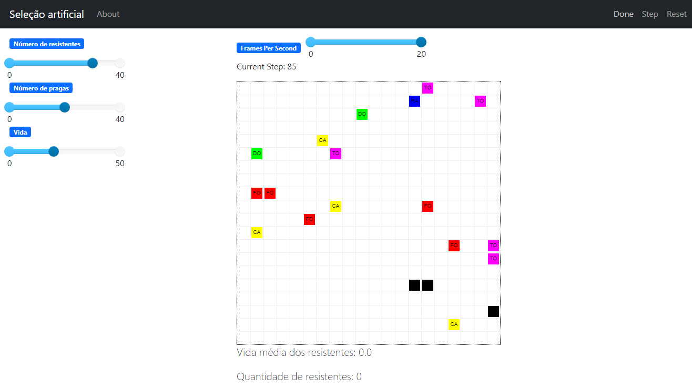

# Seleção Artificial

**Disciplina**: FGA0210 - PARADIGMAS DE PROGRAMAÇÃO - T01 <br>
**Nro do Grupo**: 04<br>
**Paradigma**: SMA<br>

## Alunos
|Matrícula | Aluno |
| -- | -- |
| 18/0096991  |  Álvaro Leles |
| 18/0100831  |  Gabriel Avelino |
| 18/0145088  |  Gabriel Bonifácio |
| 18/0101617  |  Guilherme de Morais |
| 18/0102087  |  Ian Fillipe |
| 18/0113666  |  Ítalo Guimarães |
| 18/0102656  |  Ítalo Vinícius |
| 20/0043111  |  Ricardo De Castro |

## Sobre 

O projeto que desenvolvemos se trata de um sistema de seleção artifical em um ambiente caótico. Dessa forma, a ideia principal é poder controlar vários fatores como fome,frio,calor, e etc... de agentes com diferentes características para podermos fazer a identificação dos agentes mais resistentes dos que tem menos resistência. Com a utilização do framework MESA e a construção de agentes no contexto dito acima, é possível aplicar conceitos do paradigma de sistemas multi-agentes, observando o comportamento desses agentes nas possibilidades que o sistema construído permite modificar.

## Screenshots

### Imagem 1


### Imagem 2


### Imagem 3


### Imagem 4


### Imagem 5


## Instalação 
**Linguagens**: Python<br>
**Tecnologias**: Mesa<br>
(É necessário para rodar esta aplicação Python e recomenda-se rodá-la no ambiente Ubuntu ou utilizando no Windows o WSL)
Para instalar as dependências no Ubuntu, basta digitar o comando:
```
pip install -r requirements.txt
```
Para rodar o código após ter instalado o ambiente digite os comandos abaixo:

```
mesa runserver
```

## Uso 

Com o código sendo executado, na interface do MESA, o usuário pode realizar as seguintes ações:

- Manipular os _sliders_ para modificar os parâmetros do ambiente, localizados no canto superior esquerdo da tela.
    - **Número de resistentes:** Controla o número de agentes resistentes que aparecerão no grid
    - **Número de pragas:** Controla o número de agentes pragas que aparecerão no grid
    - **Vida:** Controla a vida inicial dos agentes resistentes


- Manipular o _slider_ para modificar a velocidade da simulação, localizado no parte superior do _grid_.


- Pressionar o botões de controle da simulação, localizados no canto superior direito da tela
    - **Start:** Inicia a simulação
    - **Stop:** Para a simulação
    - **Reset:** Reseta a simulação
    - **Step:** Executa um passo da simulação


Clicando em _Start_ a simulação começará a ser executada e os gráficos na parte inferior do _grid_ começarão a ser atualizados, assim como as informações de 'Vida média dos resistentes' e 'Quantidade de resistentes'.

## Vídeo

#### [Apresentação final do projeto](https://youtu.be/ie43-1VPArY)

## Participações
Apresente, brevemente, como cada membro do grupo contribuiu para o projeto.
|Nome do Membro | Contribuição | Significância da Contribuição para o Projeto (Excelente/Boa/Regular/Ruim/Nula) |
| -- | -- | -- |
| Álvaro Leles  | Participei da construção dos agentes do nosso sistema, pensando nas possibilidades de agentes que poderiam ser criados e nas interações possíveis entre eles.  | Boa |
| Gabriel Avelino  | Participei ajudando na lógica do projeto e criação da interface utilizando o mesa.  | Boa |
| Gabriel Bonifácio | Participei no ajuste de algumas variáveis de forma a padronizar melhor o código e na explicação do código feito no readme. | Regular |
| Guilherme de Morais  | Participei da criação da interface gráfica, definindo propriedades visuais para os agentes, os diferenciando por cores. Também desenvolvi elementos visuais de contagem de informações importantes que nos ajudaram a entender como os agentes estavam se comportando, como a vida média dos agentes e a quantidade de agentes resistentes no momento em que a aplicação está sendo rodada.  | Boa |
| Ítalo Alves  | Contribuição geral no projeto/código e em testes na utilização do programa. | Boa |
| Ian Fillipe | Participei da criação da interface gráfica no MESA, definindo os gráficos e a diferenciação dos agentes no grid, além de dar suporte no desenvolvimento. | Boa |
| Ítalo Vinícius | Adição das lógicas principais, suporte no desenvolvimento, desenvolvimento dos agentes,modelo e também as estratégias dos agentes pragas para consumir a vida dos agentes resistentes.  | Excelente |
| Ricardo Castro  | Implementando a lógica do projeto e como funciona os agentes Resistentes e suas açoes e suas regras com agentes pragas. | Boa |

## Outros 
Quaisquer outras informações sobre o projeto podem ser descritas aqui.
(i) Lições Aprendidas;

- Manipulação dos agentes e como eles interagem com o sistema criado e as possibilidades de manipulação desse sistema;
- Criação e manipulação do modelo;
- Ilustração gráfica dos agentes e seus comportamentos em tempo real, baseados no framework MESA;
- Entendimentos de como os agentes interagem tanto entre si quanto com o sistema;
- Entender como o modelo manipula os agentes;

(ii) Percepções;

- Gostamos de explorar esse paradigma, visto que é bastante diferente de muitas coisas que já experimentamos desenvolver na universidade;
- Achamos que é bastante prático;
- Existe muitas aplicações interessantes para esse paradigma;
- Entendemos a importância de um paradigma como o de Seleção Artificial em diversos âmbitos da vida real. Sua aplicação pode colaborar de diversas formas, e foi o paradigma que mais percebemos ser diferentes dos demais que também fizemos. Tivemos uma certa dificuldade em alguns pontos, mas uma maior facilidade em outros, assim como tivemos essa dualidade em outros projetos.

(iii) Contribuições e Fragilidades, e

- Posicionamento dos agentes
- Visualização das informações

(iV) Trabalhos Futuros.

- Melhoria na estratégia de retirada de vida
- Melhorar a estratégia de jogo em relação aos males dos agentes pragas e como eles interagem com os agentes resistentes
- Mudar a estratégia de movimentação
- Estratificar as pragas ao criar o modelo para que a quantidade seja identica entre eles e não de forma aleatória
- Melhorar a visualização do sistema, com imagens mais amigáveis para representar os agentes por exemplo

## Fontes

- [Conteúdos disponibilizados no moodle UnB da disciplina](https://aprender3.unb.br/course/view.php?id=14113)
- [Documentação do framework MESA](https://mesa.readthedocs.io/en/main/index.html)
- [Exemplos do framework](https://github.com/projectmesa/mesa/tree/main/examples)
- [Artigo de introdução ao framework MESA](https://github.com/projectmesa/mesa/tree/main/examples)